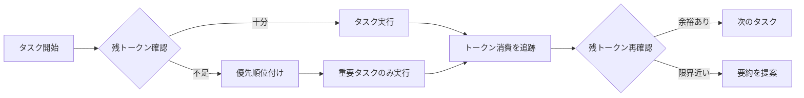

# Anthropic公式 Claude Code - コンテキスト管理

## 目次
1. [概要](#概要)
2. [2025年の新機能](#2025年の新機能)
3. [CLAUDE.mdファイル](#claudemdファイル)
4. [Subagentsによるタスク分離](#subagentsによるタスク分離)
5. [メモリ階層](#メモリ階層)
6. [コンテキストクリア戦略](#コンテキストクリア戦略)
7. [Context Awareness](#context-awareness)
8. [ベストプラクティス](#ベストプラクティス)

---

## 概要

[Claude Code](https://claude.com/product/claude-code)は、Anthropic社が提供する公式のAIコーディングツールで、ターミナルやIDEで動作するエージェント型コーディングアシスタントです。

### 主要機能

- **ターミナル統合**: コマンドラインから直接Claudeと対話
- **コードベース理解**: リポジトリ全体のコンテキストを把握
- **自然言語コマンド**: 日常的なタスクを自然言語で実行
- **Git統合**: ワークフローの自動化
- **IDE拡張**: VS Code、JetBrainsとのネイティブ統合

### 公式リソース

- **GitHub**: [anthropics/claude-code](https://github.com/anthropics/claude-code)
- **ドキュメント**: [code.claude.com/docs](https://code.claude.com/docs/en/cli-reference)
- **公式ブログ**: [claude.com/blog](https://claude.com/blog/using-claude-md-files)

---

## 2025年の新機能

### Context Editing（コンテキスト編集）

**リリース**: 2025年

**概要**: トークン制限に近づいたときに、古いツール呼び出しと結果を自動的にクリアする機能。

**仕組み**:
```
会話履歴
├─ user: "ファイルAを読んで"
├─ assistant: [tool_use: read_file]
├─ user: [tool_result: ファイルA内容]
├─ assistant: "内容は..."
├─ user: "ファイルBを読んで"
├─ assistant: [tool_use: read_file]
├─ user: [tool_result: ファイルB内容]  ← 古いツール結果を削除
└─ assistant: "内容は..."
```

**性能向上**:
- Context Editing単独: **29%の性能向上**
- Memory Tool併用: **39%の性能向上**

出典: [Managing context on the Claude Developer Platform](https://claude.com/blog/context-management)

### Memory Tool（メモリツール）

**概要**: 長期実行タスク用の永続的メモリ。

**機能**:
- 重要な決定事項を保存
- アーキテクチャの選択を記録
- 未解決の問題を追跡

**利点**:
- セッションを超えた文脈保持
- コンテキストウィンドウの節約
- 一貫性のある意思決定

### 1Mトークンコンテキストウィンドウ

**対象モデル**: Claude Sonnet 4

**標準**: 200,000トークン（Claude 3.5/3.7 Sonnet）
**拡張**: 1,000,000トークン（Usage Tier 4以上）

**利用可能プラットフォーム**:
- Claude API
- Microsoft Foundry
- Amazon Bedrock
- Google Cloud Vertex AI

**実用例**:
```
中規模リポジトリ（~50ファイル、10,000行）
→ 約100,000トークン
→ 1Mトークンウィンドウなら10倍のリポジトリを処理可能
```

出典: [Context windows - Claude Docs](https://platform.claude.com/docs/en/build-with-claude/context-windows)

### Context Awareness（コンテキスト認識）

**対象モデル**: Claude Sonnet 4.5、Claude Haiku 4.5

**機能**: モデルが自身の残りコンテキストウィンドウ（トークン予算）を追跡。

**メリット**:
- タスク実行の優先順位付け
- 効率的なコンテキスト管理
- 自動的な最適化

**例**:
```
Claude: "残り50,000トークンです。このタスクには
        約30,000トークン必要なので、実行可能です。"
```

---

## CLAUDE.mdファイル

### 概要

**CLAUDE.md**は、プロジェクトルートに配置する特別なMarkdownファイルで、Claude Codeが自動的に読み込み、システムプロンプトの一部として使用します。

### 基本構造

```markdown
# プロジェクト概要
このプロジェクトの説明...

## コア技術
- TypeScript
- React
- Node.js

## コーディング規約
- ESLint設定に従う
- Prettierでフォーマット
- Jest/Vitestでテスト

## 禁止事項
- レガシーコードの書き換え禁止
- 設定ファイルの変更前に確認

## よく使うコマンド
```bash
npm run dev    # 開発サーバー起動
npm run test   # テスト実行
npm run build  # ビルド
```
```

### セクション推奨事項

#### 1. プロジェクト概要
```markdown
# プロジェクト概要
このプロジェクトは、eコマースプラットフォームのバックエンドAPIです。
主な機能：
- ユーザー認証（JWT）
- 商品管理
- 注文処理
- 決済統合（Stripe）
```

#### 2. アーキテクチャ
```markdown
## アーキテクチャ
```
src/
├── controllers/  # リクエストハンドラー
├── services/     # ビジネスロジック
├── models/       # データモデル
├── routes/       # ルート定義
└── utils/        # ユーティリティ
```

Clean Architecture原則に従う
```

#### 3. コーディング規約
```markdown
## コーディング規約

### TypeScript
- strict mode有効
- any型の使用禁止
- すべての関数に型注釈

### 命名規則
- ファイル名: kebab-case
- クラス名: PascalCase
- 関数名: camelCase
- 定数: UPPER_SNAKE_CASE

### インポート順序
1. 外部ライブラリ
2. 内部モジュール
3. 型定義
4. スタイル
```

#### 4. テスト戦略
```markdown
## テスト戦略
- ユニットテスト: Jest
- 統合テスト: Supertest
- E2Eテスト: Playwright

### テストカバレッジ要件
- 関数: 80%以上
- ブランチ: 70%以上
- 行: 85%以上
```

#### 5. 禁止事項
```markdown
## 禁止事項（Do Not Touch）
- `config/legacy.js` - 本番環境で使用中、変更禁止
- `src/old-api/` - 廃止予定だが削除しない
- `.env.production` - 環境変数は直接編集しない
```

### 高度な機能

#### ファイルのインポート

```markdown
# メインガイドライン
@docs/coding-standards.md

## API設計
@docs/api-design-principles.md
```

#### 条件付きルール

`.claude/rules/`ディレクトリに配置したMarkdownファイルは自動ロード：

```markdown
---
paths:
  - "src/api/**/*.ts"
  - "src/routes/**/*.ts"
---

# API開発ルール
このルールはAPIファイルにのみ適用されます。

- すべてのエンドポイントにOpenAPI仕様を記述
- エラーレスポンスは統一フォーマット
- レート制限を実装
```

#### プログレッシブディスクロージャー

❌ **悪い例（すべてを詰め込む）**:
```markdown
## データベーススキーマ
User:
  - id: UUID
  - name: String
  - email: String
  - created_at: DateTime
  - updated_at: DateTime

Product:
  - id: UUID
  - name: String
  - price: Decimal
  ...（全テーブル定義）
```

✅ **良い例（必要に応じて参照）**:
```markdown
## データベース
スキーマ定義: @docs/database-schema.md
マイグレーション手順: @docs/migrations.md

主要テーブル: users, products, orders
```

### サイズガイドライン

**推奨**: 300行以下（短いほど良い）

**理由**:
- フロンティアLLMは150-200の指示に従える
- 小さいモデルはさらに少ない
- 長すぎると重要な指示が埋もれる

出典: [Writing a good CLAUDE.md](https://www.humanlayer.dev/blog/writing-a-good-claude-md)

### 実例テンプレート

公式テンプレート集: [CLAUDE MD Templates](https://github.com/ruvnet/claude-flow/wiki/CLAUDE-MD-Templates)

コミュニティ例: [claude-md-examples](https://github.com/ArthurClune/claude-md-examples)

---

## Subagentsによるタスク分離

### 概要

**Subagents**は、特定のタスクに特化したClaude Codeのサブプロセスで、独立したコンテキストウィンドウとツール権限を持ちます。

### ディレクトリ構造

```
プロジェクトルート/
├── .claude/
│   ├── agents/              # プロジェクト固有のSubagents
│   │   ├── code-reviewer.md
│   │   ├── test-writer.md
│   │   └── api-designer.md
│   └── rules/               # 条件付きルール
│       ├── api-rules.md
│       └── ui-rules.md
└── CLAUDE.md

ホームディレクトリ/
└── .claude/
    ├── agents/              # グローバルSubagents
    │   ├── general-helper.md
    │   └── security-auditor.md
    └── CLAUDE.md            # グローバル設定
```

### Subagentファイル形式

```markdown
---
name: code-reviewer
description: コードレビューを実施し、品質とベストプラクティスを確認
tools: Read, Grep, Glob
---

# Code Reviewer Agent

あなたは経験豊富なコードレビュアーです。以下の観点でコードをレビューします：

## チェックリスト

### コード品質
- [ ] 命名規則に従っているか
- [ ] 関数は単一責任原則に従っているか
- [ ] 複雑度は適切か（Cyclomatic Complexity < 10）
- [ ] マジックナンバーを避けているか

### セキュリティ
- [ ] 入力検証は十分か
- [ ] SQLインジェクション対策
- [ ] XSS対策
- [ ] 認証/認可は適切か

### パフォーマンス
- [ ] N+1クエリ問題はないか
- [ ] 不要なループはないか
- [ ] メモリリークの可能性はないか

### テスト
- [ ] テストカバレッジは十分か
- [ ] エッジケースをテストしているか
- [ ] モックは適切に使用されているか

## レビューフォーマット

**ファイル**: [ファイルパス]
**評価**: ✅ Good / ⚠️ Needs Improvement / ❌ Issues Found

**コメント**:
1. [具体的な指摘]
2. [改善提案]

**推奨変更**:
```[言語]
// 変更前
[既存コード]

// 変更後
[改善コード]
```
```

### ツール権限設定

| Subagentタイプ | 推奨ツール |
|---------------|-----------|
| 読み取り専用 | Read, Grep, Glob |
| リサーチ | Read, Grep, Glob, WebFetch, WebSearch |
| コード作成 | Read, Write, Edit, Bash, Glob, Grep |
| ドキュメント | Read, Write, Edit, Glob, Grep, WebFetch, WebSearch |
| テスト | Read, Write, Edit, Bash, Glob, Grep |

### 呼び出し方法

```bash
# 対話的に選択
@

# 名前で直接呼び出し
@code-reviewer

# 引数付き
@test-writer "ユーザー認証機能のテストを書いて"
```

### 実例: テストライター Subagent

```markdown
---
name: test-writer
description: コンポーネントや関数のテストコードを作成
tools: Read, Write, Edit, Bash, Glob, Grep
---

# Test Writer Agent

あなたは経験豊富なテストエンジニアです。

## テスト戦略

### ユニットテスト
- すべての公開関数をテスト
- エッジケース（null, undefined, 空配列など）を網羅
- エラーケースを確認

### 統合テスト
- モジュール間の連携を確認
- APIエンドポイントのテスト
- データベース操作の検証

### テストパターン

#### AAA (Arrange-Act-Assert)
```typescript
describe('UserService', () => {
  it('should create a new user', async () => {
    // Arrange
    const userData = { name: 'John', email: 'john@example.com' }

    // Act
    const user = await userService.create(userData)

    // Assert
    expect(user.id).toBeDefined()
    expect(user.name).toBe('John')
  })
})
```

#### Given-When-Then
```typescript
it('should reject invalid email', async () => {
  // Given
  const invalidEmail = 'not-an-email'

  // When
  const result = userService.validateEmail(invalidEmail)

  // Then
  expect(result).toBe(false)
})
```

## カバレッジ目標
- ブランチカバレッジ: 80%以上
- 関数カバレッジ: 90%以上
```

出典: [Subagents - Claude Code Docs](https://code.claude.com/docs/en/sub-agents)

### コミュニティSubagents

- [awesome-claude-code-subagents](https://github.com/VoltAgent/awesome-claude-code-subagents) - 100以上の専門Subagents
- [claude-code-sub-agents](https://github.com/lst97/claude-code-sub-agents) - フルスタック開発用
- [claude-code-subagents](https://github.com/0xfurai/claude-code-subagents) - 本番環境対応コレクション

---

## メモリ階層

### 4層のメモリ構造

Claude Codeは階層的なメモリシステムを提供し、優先順位の高いものから順にロードされます：

```
1. ホームディレクトリ (~/.claude/CLAUDE.md)
   ↓ グローバル設定、すべてのセッションに適用

2. プロジェクトレベル (./CLAUDE.md)
   ↓ プロジェクト固有の設定

3. ローカル設定 (./CLAUDE.local.md)
   ↓ 個人設定、.gitignoreに自動追加

4. ルールディレクトリ (./.claude/rules/*.md)
   ↓ 条件付きルール、特定ファイルパターンに適用
```

### 使い分けガイドライン

#### ~/.claude/CLAUDE.md（グローバル）

**用途**: すべてのプロジェクトで共通の設定

```markdown
# 個人のコーディングスタイル
- インデント: スペース2個
- セミコロン: 常に使用
- シングルクォート優先

# よく使うツール
- エディタ: VS Code
- シェル: zsh
- パッケージマネージャ: pnpm

# セキュリティルール
- 秘密情報をコミットしない
- .envファイルは.gitignoreに追加
```

#### ./CLAUDE.md（プロジェクト）

**用途**: チーム全体で共有する設定

```markdown
# チームの規約
- ブランチ名: feature/*, bugfix/*, hotfix/*
- コミットメッセージ: Conventional Commits
- PRレビュー: 最低2人の承認必要

# プロジェクト構造
@docs/architecture.md
```

#### ./CLAUDE.local.md（ローカル）

**用途**: 個人のプレフェレンス、チームと共有しない設定

```markdown
# 個人メモ
- テスト環境: http://localhost:3000
- デバッグ用ユーザー: test@example.com

# 個人的な優先事項
- パフォーマンス最適化を優先
- 可読性よりも効率性
```

出典: [Manage Claude's memory](https://code.claude.com/docs/en/memory)

---

## コンテキストクリア戦略

### /clearコマンド

**目的**: コンテキストウィンドウをクリアし、新しい会話を開始

**使用タイミング**:
1. 機能完了後
2. 異なるタスクに切り替える前
3. コンテキストが無関係な情報で埋まった時
4. エラーや混乱が続く時

```bash
# 基本的な使い方
> /clear

# 確認メッセージ
Context cleared. Starting fresh conversation.
```

### クリア戦略

#### 1. 機能ベースクリア

```
機能A開発
├─ 実装
├─ テスト
└─ レビュー  → /clear

機能B開発
├─ 実装
...
```

#### 2. タスクベースクリア

```
タスク1: バグ修正 → /clear
タスク2: 新機能 → /clear
タスク3: リファクタリング → /clear
```

#### 3. 定期的クリア

```
30分ごと
または
メッセージ数が50を超えたら
```

### Subagentsとの組み合わせ

```bash
# メインセッション: 機能実装
> "ユーザー認証APIを実装"

# Subagent呼び出し（独立したコンテキスト）
> @code-reviewer "認証コードをレビュー"

# メインセッションに戻る
> "次の機能に移る前にクリア"
> /clear
```

**メリット**:
- メインセッションをクリーンに保つ
- Subagentsが独立して動作
- タスク間の干渉を防ぐ

出典: [How I Use Every Claude Code Feature](https://blog.sshh.io/p/how-i-use-every-claude-code-feature)

---

## Context Awareness

### 概要

Claude Sonnet 4.5とHaiku 4.5に搭載された機能で、モデルが自身の残りトークン予算を追跡し、効果的にタスクを管理します。

### 仕組み



### 実用例

#### シナリオ1: 大規模リファクタリング

```
Claude: "このリファクタリングには約80,000トークン必要です。
        現在のコンテキストウィンドウの残りは120,000トークンなので、
        実行可能です。ただし、完了後は/clearを推奨します。"
```

#### シナリオ2: トークン不足の警告

```
Claude: "残りトークンが30,000です。このタスクには50,000トークン
        必要なため、先にコンテキストをクリアするか、
        タスクを分割することをお勧めします。"
```

### メリット

1. **プロアクティブな管理**: トークン切れ前に警告
2. **効率的な実行**: タスクを適切にサイズ調整
3. **透明性**: トークン使用状況を可視化

---

## ベストプラクティス

### 1. "Context Engineer"になる

> "プロンプトエンジニアリングの時代は終わりました。
> これからは**コンテキストエンジニアリング**です。"

**コンテキストエンジニアリングの原則**:
1. スコープを1つのプロジェクトや機能に限定
2. 機能完了後は頻繁に`/clear`
3. CLAUDE.mdで明確なガイドラインを設定
4. Subagentsでタスクを分離
5. トークン予算を常に意識

出典: [Mastering Context Management in Claude Code CLI](https://lalatenduswain.medium.com/mastering-context-management-in-claude-code-cli-your-guide-to-efficient-ai-assisted-coding-83753129b28e)

### 2. CLAUDE.md最適化

#### ✅ 良い例

```markdown
# プロジェクト: eコマースAPI

## 技術スタック
Node.js, TypeScript, PostgreSQL, Redis

## 重要なルール
- すべてのAPIエンドポイントにバリデーション
- エラーハンドリングは統一フォーマット
- 詳細はドキュメント参照 → @docs/api-guidelines.md

## よく使うコマンド
npm run dev, npm run test
```

**特徴**: 簡潔、参照ベース、普遍的

#### ❌ 悪い例

```markdown
# プロジェクト説明
これはeコマースプラットフォームです。主な機能は商品管理、
ユーザー管理、注文処理です。データベースはPostgreSQLを使い、
キャッシュにはRedisを使います。認証はJWTで...（長々と続く）

## すべてのAPIエンドポイント
GET /api/users - ユーザー一覧取得
  - パラメータ: page, limit, sort
  - レスポンス: { users: [...], total: number }
POST /api/users - ユーザー作成
  - ボディ: { name, email, password }
  - レスポンス: { user: {...} }
...（全エンドポイント列挙）
```

**問題**: 長すぎる、特定タスクに偏っている、メンテナンス困難

### 3. Subagents活用パターン

#### パターン1: レビューワークフロー

```bash
# 1. 機能実装（メインセッション）
> "ユーザー認証機能を実装"

# 2. コードレビュー（Subagent）
> @code-reviewer

# 3. テスト作成（Subagent）
> @test-writer "認証機能のテストを作成"

# 4. ドキュメント更新（Subagent）
> @doc-writer "API仕様書を更新"

# 5. クリーンアップ
> /clear
```

#### パターン2: 並行開発

```bash
# Terminal 1: フロントエンド開発
> "React コンポーネントを実装"

# Terminal 2: バックエンド開発（独立したセッション）
> "対応するAPIエンドポイントを実装"

# 各セッションが独立したコンテキストを維持
```

### 4. 定期メンテナンス

```markdown
# CLAUDE.mdメンテナンスチェックリスト

## 週次
- [ ] 古い情報を削除
- [ ] 新しいパターンを追加
- [ ] リンク切れをチェック

## 月次
- [ ] ファイルサイズ確認（<300行）
- [ ] チームフィードバック反映
- [ ] 未使用セクション削除

## 四半期
- [ ] 全面的な見直し
- [ ] 新しいベストプラクティス統合
```

出典: [Writing a good CLAUDE.md](https://www.humanlayer.dev/blog/writing-a-good-claude-md)

### 5. トークン効率化テクニック

#### テクニック1: ファイル参照

```markdown
❌ すべてのスキーマ定義をCLAUDE.mdに記述

✅ ファイルパスを指示
データベーススキーマ: <file_map>prisma/schema.prisma</file_map>
```

#### テクニック2: モジュール化

```markdown
.claude/rules/
├── api-rules.md         # API開発時のみ適用
├── ui-rules.md          # UI開発時のみ適用
└── database-rules.md    # DB操作時のみ適用
```

#### テクニック3: 要約戦略

```markdown
## 最近の変更（要約）
- 2025/01: 認証システムをOAuth2に移行
- 2024/12: PostgreSQL → MySQL移行
- 詳細: @CHANGELOG.md
```

---

## まとめ

Anthropic公式Claude Codeは、以下の強力なコンテキスト管理機能を提供します：

1. **Context Editing**: 自動的な古い情報のクリア
2. **Memory Tool**: セッションを超えた永続メモリ
3. **1Mトークンウィンドウ**: 大規模リポジトリの処理
4. **Context Awareness**: 自己管理するトークン予算
5. **CLAUDE.md**: 構造化されたプロジェクト知識
6. **Subagents**: タスク分離とコンテキスト隔離

これらを組み合わせることで、長期的なコーディングセッションでも高いパフォーマンスを維持できます。

---

## 次のステップ

- [02-roo-code-implementation.md](./02-roo-code-implementation.md) - Roo Codeの実装詳細
- [03-industry-patterns.md](./03-industry-patterns.md) - 業界標準パターン
- [05-practical-guide.md](./05-practical-guide.md) - 実践ガイド

---

## Sources

- [Using CLAUDE.MD files](https://claude.com/blog/using-claude-md-files)
- [Managing context on the Claude Developer Platform](https://claude.com/blog/context-management)
- [Context windows - Claude Docs](https://platform.claude.com/docs/en/build-with-claude/context-windows)
- [Claude Code: Best practices for agentic coding](https://www.anthropic.com/engineering/claude-code-best-practices)
- [Subagents - Claude Code Docs](https://code.claude.com/docs/en/sub-agents)
- [Writing a good CLAUDE.md](https://www.humanlayer.dev/blog/writing-a-good-claude-md)
- [What's a Claude.md File?](https://apidog.com/blog/claude-md/)
- [How I Use Every Claude Code Feature](https://blog.sshh.io/p/how-i-use-every-claude-code-feature)
- [Mastering Context Management in Claude Code CLI](https://lalatenduswain.medium.com/mastering-context-management-in-claude-code-cli-your-guide-to-efficient-ai-assisted-coding-83753129b28e)
