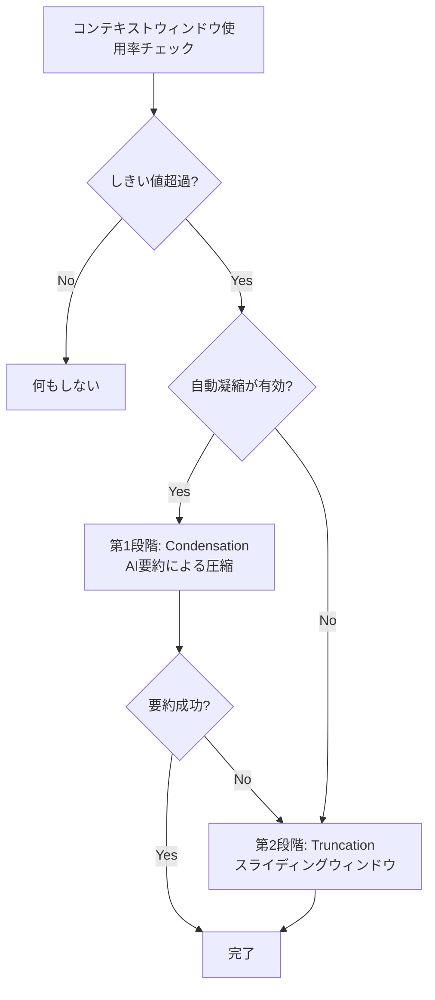

# Roo Code（旧Claude Code）のコンテキスト管理実装

## 概要

Roo Codeは、元々「Claude Code」という名前のコミュニティプロジェクトでしたが、Anthropicの公式ツールと区別するためにリブランディングされました。

このプロジェクトは、**非破壊的な二段階コンテキスト管理**システムを実装しています。

---

## 📚 詳細ドキュメント

Roo Codeのコンテキスト管理の詳細な実装については、専用のドキュメントセットを参照してください：

### [../context-management/](../context-management/)

#### [01-overview.md](../context-management/01-overview.md)
**概要とアーキテクチャ**
- コンテキスト管理の課題
- 二段階アプローチ（Condensation + Truncation）
- アーキテクチャ概要
- 非破壊的管理の仕組み
- データフロー図

#### [02-implementation.md](../context-management/02-implementation.md)
**実装の詳細**
- `manageContext()` 関数の完全な処理フロー
- Condensation（凝縮）の実装
  - `summarizeConversation()` の詳細
  - tool_use/tool_resultペア保持メカニズム
  - サマリープロンプトの構造
- Truncation（トランケーション）の実装
  - スライディングウィンドウアルゴリズム
  - 偶数メッセージ削除の理由
- MessageManagerの実装
  - 巻き戻し処理フロー
  - レースコンディション対策
- トークンカウンティングの実装
- 実装例とベストプラクティス

#### [03-api-reference.md](../context-management/03-api-reference.md)
**APIリファレンス**
- すべての公開関数の仕様
- 型定義の完全リスト
- パラメータとリターン値
- 使用例
- エラーケース

#### [04-advanced-topics.md](../context-management/04-advanced-topics.md)
**高度なトピック**
- チェックポイントとの統合
- UIコンポーネント
- プロファイル別設定
- テレメトリとモニタリング
- パフォーマンス最適化
- エラーハンドリングとリトライ
- トラブルシューティング

---

## 🎯 主要機能のサマリー

### 1. 二段階アプローチ



**第1段階: Condensation（凝縮）**
- LLMを使った知的な要約
- 70-90%のトークン削減
- 重要な情報を保持
- コスト: 中（LLM API呼び出し）

**第2段階: Truncation（トランケーション）**
- スライディングウィンドウ方式
- 確実なトークン削減
- シンプルで信頼性が高い
- コスト: なし

### 2. 非破壊的管理

メッセージは物理的に削除されず、タグ付けで管理：

```typescript
// 凝縮後のメッセージ
{
  role: "user",
  content: "Hello",
  ts: 1000,
  condenseParent: "uuid-123"  // ← このサマリーに置き換えられた
}

// サマリーメッセージ
{
  role: "assistant",
  content: [...],
  ts: 2999,
  isSummary: true,
  condenseId: "uuid-123"  // ← 一意識別子
}
```

**メリット**:
- データ損失なし
- いつでも過去の状態に戻せる
- チェックポイント機能との完全な統合

### 3. MessageManager

会話の巻き戻し操作を一元管理：

```typescript
// メッセージ削除/編集時
await task.messageManager.rewindToTimestamp(messageTs, {
  includeTargetMessage: operation === "delete"
})

// 自動的に以下を実行：
// 1. 孤立したサマリーメッセージを削除
// 2. 孤立したトランケーションマーカーを削除
// 3. condenseParent/truncationParentタグをクリーンアップ
```

### 4. チェックポイント統合

Shadow Gitリポジトリとの同期：

```typescript
// コンテキスト管理イベント発生時
this.addClineMessage({
  type: "say",
  say: "condense_context",
  ts: Date.now(),
  contextCondense: {
    condenseId,
    summary,
    cost,
    prevContextTokens,
    newContextTokens
  }
})

// 自動チェックポイント作成（設定により）
await this.saveCheckpoint(`Context condensed: ${tokens} tokens`)
```

---

## 🔑 主要な実装コンポーネント

### コアモジュール

| モジュール | ファイル | 説明 |
|-----------|---------|------|
| Context Management | `src/core/context-management/index.ts` | メインの制御フロー |
| Condensation | `src/core/condense/index.ts` | AI要約による凝縮 |
| Message Manager | `src/core/message-manager/index.ts` | 巻き戻し操作の管理 |
| Task Persistence | `src/core/task-persistence/apiMessages.ts` | メッセージの永続化 |
| Token Counting | `src/utils/tiktoken.ts` | トークン数の計算 |

### 主要関数

```typescript
// コンテキスト管理のメインエントリーポイント
manageContext(options: ContextManagementOptions): Promise<ContextManagementResult>

// 事前チェック（UI進行状況表示用）
willManageContext(options: WillManageContextOptions): boolean

// AI要約による凝縮
summarizeConversation(messages, apiHandler, systemPrompt, ...): Promise<SummarizeResponse>

// スライディングウィンドウトランケーション
truncateConversation(messages, fracToRemove, taskId): TruncationResult

// 有効なメッセージのフィルタリング
getEffectiveApiHistory(messages: ApiMessage[]): ApiMessage[]

// 孤立したタグのクリーンアップ
cleanupAfterTruncation(messages: ApiMessage[]): ApiMessage[]
```

---

## 📊 性能指標

### トークン削減効果

| 手法 | 削減率 | コスト | 情報保持 |
|------|--------|--------|---------|
| Condensation | 70-90% | 中 | 高 |
| Truncation | 30-50% | なし | 低 |
| 組み合わせ | 最大90% | 中 | 中-高 |

### 重要な定数

```typescript
TOKEN_BUFFER_PERCENTAGE = 0.1          // 10%バッファ予約
N_MESSAGES_TO_KEEP = 3                 // 凝縮時に保持する最新メッセージ数
MIN_CONDENSE_THRESHOLD = 5             // 最小しきい値 5%
MAX_CONDENSE_THRESHOLD = 100           // 最大しきい値 100%
TOKEN_FUDGE_FACTOR = 1.5               // トークン推定誤差係数
FORCED_CONTEXT_REDUCTION_PERCENT = 75  // 強制削減時の保持率
MAX_CONTEXT_WINDOW_RETRIES = 3         // 最大リトライ回数
```

---

## 💡 使用例

### 基本的な使い方

```typescript
import { manageContext, getEffectiveApiHistory } from './core/context-management'

// 1. コンテキスト管理を実行
const result = await manageContext({
  messages: apiConversationHistory,
  totalTokens: currentTokenCount,
  contextWindow: 200000,
  maxTokens: 4096,
  apiHandler: api,
  autoCondenseContext: true,
  autoCondenseContextPercent: 75,
  systemPrompt: SYSTEM_PROMPT,
  taskId: "task-123",
  profileThresholds: {},
  currentProfileId: "default",
  useNativeTools: true
})

// 2. 更新されたメッセージを保存
apiConversationHistory = result.messages

// 3. API送信用にフィルタリング
const effectiveHistory = getEffectiveApiHistory(apiConversationHistory)

// 4. APIリクエスト送信
const response = await api.createMessage(systemPrompt, effectiveHistory)
```

### 進行状況インジケータ

```typescript
// UI側で事前チェック
const willManage = willManageContext({
  totalTokens: currentTokens,
  contextWindow: 200000,
  maxTokens: 4096,
  autoCondenseContext: true,
  autoCondenseContextPercent: 75,
  profileThresholds: {},
  currentProfileId: "default",
  lastMessageTokens: 500
})

if (willManage) {
  showInProgressIndicator("Condensing context...")
}
```

### メッセージ巻き戻し

```typescript
// MessageManagerを使用（必須）
await task.messageManager.rewindToTimestamp(messageTs, {
  includeTargetMessage: operation === "delete"
})

// ❌ 直接削除しない
// task.clineMessages = task.clineMessages.filter(...)
// task.apiConversationHistory = task.apiConversationHistory.filter(...)
```

---

## 🎨 UIコンポーネント

### コンテキストウィンドウプログレス

トークン使用状況を3段階で視覚化：

```tsx
<ContextWindowProgress
  contextTokens={140000}      // 使用中（青）
  contextWindow={200000}      // 総容量
  maxTokens={4096}            // 予約済み（黄）
/>
// 利用可能（灰）= 残り
```

### 凝縮結果表示

```tsx
<CondensationResultRow
  cost={0.05}
  prevContextTokens={150000}
  newContextTokens={45000}
  summary="Previous Conversation: ..."
  condenseId="uuid-123"
/>
```

### 設定UI

- 自動凝縮の有効/無効
- しきい値スライダー（10-100%）
- プロファイル別設定
- その他のコンテキスト関連設定

---

## 🔧 カスタマイズ

### プロファイル別しきい値

```typescript
profileThresholds: {
  "claude-opus-4": 80,     // 高性能モデルは高めに
  "claude-haiku": 60,      // 低コストモデルは低めに
  "gpt-4-turbo": 70,
  "default": -1            // グローバル設定を継承
}
```

### カスタム凝縮プロンプト

```typescript
const customPrompt = `
Summarize the conversation with focus on:
1. All code changes made
2. Current bugs and their status
3. Next implementation steps

Keep the summary under 500 words.
`

const result = await manageContext({
  ...options,
  customCondensingPrompt: customPrompt
})
```

### 専用APIハンドラー

```typescript
// メインモデル: Claude Opus（高性能）
const mainApiHandler = buildApiHandler({
  apiProvider: "anthropic",
  apiModelId: "claude-opus-4-5-20251101"
})

// 凝縮用モデル: Claude Haiku（低コスト）
const condensingApiHandler = buildApiHandler({
  apiProvider: "anthropic",
  apiModelId: "claude-3-5-haiku-20241022"
})

const result = await manageContext({
  ...options,
  apiHandler: mainApiHandler,
  condensingApiHandler: condensingApiHandler
})
```

---

## 🚀 ベストプラクティス

### 1. 適切なしきい値設定

```typescript
// 推奨値
autoCondenseContextPercent: 75  // コンテキストウィンドウの75%で凝縮開始

// モデル別推奨値
- Claude Opus: 80%（高性能、最大限活用）
- Claude Sonnet: 75%（バランス型）
- Claude Haiku: 60%（低コスト、早めに凝縮）
```

### 2. エラーハンドリング

```typescript
const result = await manageContext(options)

if (result.error) {
  console.warn(`Condensation failed: ${result.error}`)
  // トランケーションにフォールバック済み
}

if (result.truncationId) {
  console.log(`Truncated ${result.messagesRemoved} messages`)
}
```

### 3. MessageManagerの使用

```typescript
// ✅ 正しい
await task.messageManager.rewindToTimestamp(ts)

// ❌ 間違い（クリーンアップされない）
task.apiConversationHistory = task.apiConversationHistory.filter(...)
```

---

## 🧪 テスト

詳細なテストスイートが含まれています：

- `src/core/context-management/__tests__/context-management.spec.ts`
- `src/core/context-management/__tests__/truncation.spec.ts`
- `src/core/condense/__tests__/condense.spec.ts`
- `src/core/condense/__tests__/index.spec.ts`
- `src/core/condense/__tests__/rewind-after-condense.spec.ts`
- `src/core/message-manager/index.spec.ts`

---

## 📖 詳細情報

完全な実装の詳細、APIリファレンス、高度なトピックについては、専用ドキュメントを参照してください：

- **[概要](../context-management/01-overview.md)** - アーキテクチャと設計原則
- **[実装詳細](../context-management/02-implementation.md)** - 完全な実装ガイド
- **[APIリファレンス](../context-management/03-api-reference.md)** - 関数とクラスの仕様
- **[高度なトピック](../context-management/04-advanced-topics.md)** - 最適化とトラブルシューティング

---

## 🔗 関連リソース

### ソースコード
- [コンテキスト管理コア](../../src/core/context-management/index.ts)
- [凝縮モジュール](../../src/core/condense/index.ts)
- [メッセージマネージャー](../../src/core/message-manager/index.ts)
- [タスク永続化](../../src/core/task-persistence/apiMessages.ts)

### UIコンポーネント
- [コンテキストウィンドウプログレス](../../webview-ui/src/components/chat/ContextWindowProgress.tsx)
- [凝縮結果表示](../../webview-ui/src/components/chat/context-management/)
- [設定UI](../../webview-ui/src/components/settings/ContextManagementSettings.tsx)

---

## 次のステップ

- [04-comparative-analysis.md](./04-comparative-analysis.md) - 公式Claude CodeとRoo Codeの比較
- [05-practical-guide.md](./05-practical-guide.md) - 実践的な実装ガイド
