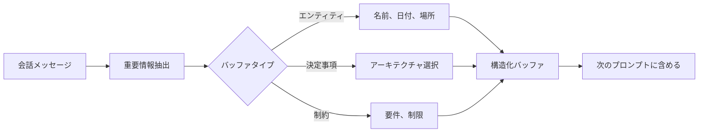
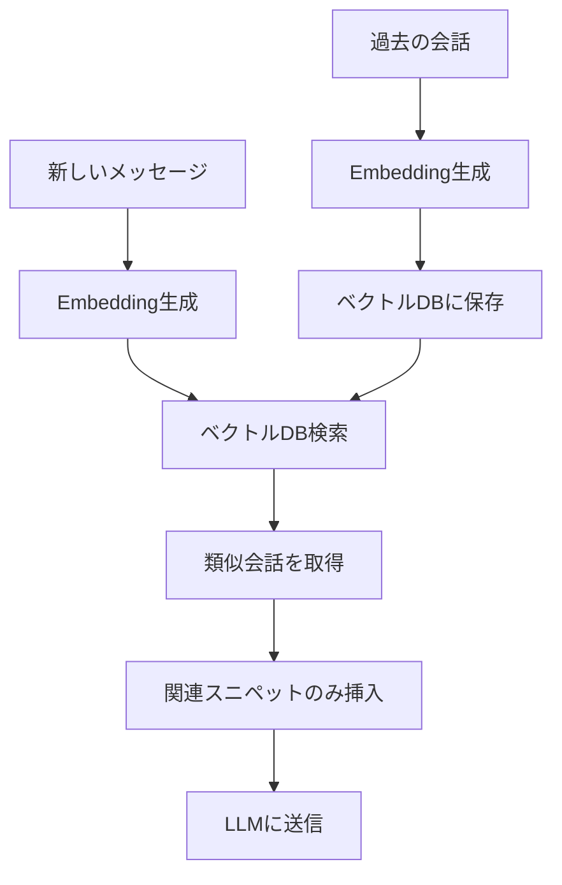
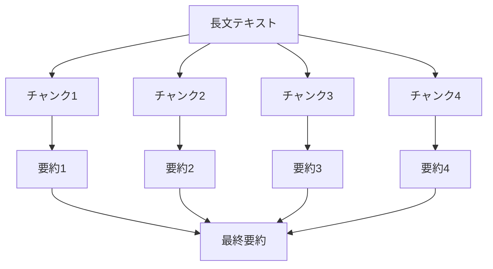

# 業界標準のLLMコンテキスト管理パターン

## 目次
1. [概要](#概要)
2. [主要な管理技術](#主要な管理技術)
3. [Summarization（要約）](#summarization要約)
4. [Memory Buffering](#memory-buffering)
5. [Observation Masking](#observation-masking)
6. [Vectorized Memory](#vectorized-memory)
7. [Hierarchical Summarization](#hierarchical-summarization)
8. [Context Editing](#context-editing)
9. [技術の比較と選択](#技術の比較と選択)
10. [実装パターン](#実装パターン)

---

## 概要

LLMアプリケーション開発において、コンテキスト管理は最も重要な課題の一つです。このドキュメントでは、業界で広く採用されている技術とパターンを解説します。

### コンテキスト管理の課題

すべてのLLMには**コンテキストウィンドウ**（一度に処理できるトークン数）の制限があります：

| モデル | コンテキストウィンドウ |
|--------|---------------------|
| GPT-4 Turbo | 128,000トークン |
| GPT-3.5 | 16,000トークン |
| Claude 3.5 Sonnet | 200,000トークン |
| Claude Sonnet 4 | 1,000,000トークン |
| Gemini 1.5 Pro | 2,000,000トークン |

長時間の会話やエージェント型タスクでは、この制限を超えてしまいます。

---

## 主要な管理技術

業界で使用されている主な技術：

1. **Truncation（トランケーション）** - 古いメッセージを削除
2. **Summarization（要約）** - 会話を圧縮
3. **Memory Buffering（メモリバッファリング）** - 重要情報を選択的に保存
4. **Observation Masking（観察マスキング）** - ツール出力を隠蔽
5. **Vectorized Memory（ベクトル化メモリ）** - 埋め込みベースの検索
6. **RAG（Retrieval-Augmented Generation）** - 外部知識ベースの活用
7. **Context Editing（コンテキスト編集）** - 不要な情報の自動削除

出典: [Top techniques to Manage Context Lengths in LLMs](https://agenta.ai/blog/top-6-techniques-to-manage-context-length-in-llms)

---

## Summarization（要約）

### 概要

**Summarization**は、LLMを使って会話履歴を要約し、トークン数を削減する技術です。

### 基本的なアプローチ

#### Contextual Summarization（文脈的要約）

**仕組み**:
- 古いメッセージ（例：20件以前）を要約
- 最近のメッセージ（例：最新10件）は完全保持

```python
def contextual_summarization(messages, keep_last_n=10, summarize_before_n=20):
    recent_messages = messages[-keep_last_n:]  # 最新10件
    old_messages = messages[:-keep_last_n]      # 古いメッセージ

    if len(old_messages) >= summarize_before_n:
        summary = llm.summarize(old_messages)
        return [{"role": "system", "content": summary}] + recent_messages

    return messages
```

**利点**:
- 重要情報を保持
- 文脈の連続性を維持
- 70-90%のトークン削減

**欠点**:
- LLM API呼び出しコスト
- 要約による詳細の損失

出典: [LLM Chat History Summarization Guide](https://mem0.ai/blog/llm-chat-history-summarization-guide-2025)

### 実装例

#### Python実装（LangChain）

```python
from langchain.memory import ConversationSummaryMemory
from langchain.llms import OpenAI

llm = OpenAI(temperature=0)
memory = ConversationSummaryMemory(llm=llm)

# 会話の追加
memory.save_context(
    {"input": "ユーザー認証機能を実装したい"},
    {"output": "JWT認証を実装しましょう..."}
)

# サマリーの取得
summary = memory.load_memory_variables({})
```

#### TypeScript実装

```typescript
class ConversationSummarizer {
  private llm: LLM
  private keepLastN: number = 10
  private summarizeThreshold: number = 20

  async summarize(messages: Message[]): Promise<Message[]> {
    const recentMessages = messages.slice(-this.keepLastN)
    const oldMessages = messages.slice(0, -this.keepLastN)

    if (oldMessages.length < this.summarizeThreshold) {
      return messages
    }

    const summary = await this.llm.complete({
      prompt: this.buildSummaryPrompt(oldMessages),
      temperature: 0.3
    })

    return [
      { role: "system", content: summary },
      ...recentMessages
    ]
  }

  private buildSummaryPrompt(messages: Message[]): string {
    return `以下の会話を簡潔に要約してください：

${messages.map(m => `${m.role}: ${m.content}`).join('\n')}

要約:`
  }
}
```

### SummarizingTokenWindowChatMemory

**概要**: トークンウィンドウ内で自動要約を行うメモリ管理パターン

**仕組み**:
```typescript
class SummarizingTokenWindowChatMemory {
  private maxTokens: number = 2000
  private summarizeWhenAbove: number = 1500

  async addMessage(message: Message): Promise<void> {
    this.messages.push(message)

    const currentTokens = this.countTokens(this.messages)

    if (currentTokens > this.summarizeWhenAbove) {
      await this.summarizeOldMessages()
    }
  }

  private async summarizeOldMessages(): Promise<void> {
    const midpoint = Math.floor(this.messages.length / 2)
    const toSummarize = this.messages.slice(0, midpoint)
    const toKeep = this.messages.slice(midpoint)

    const summary = await this.llm.summarize(toSummarize)

    this.messages = [
      { role: "system", content: summary },
      ...toKeep
    ]
  }
}
```

出典: [Enhancing LLM's Conversations with Efficient Summarization](https://foojay.io/today/summarizingtokenwindowchatmemory-enhancing-llms-conversations-with-efficient-summarization/)

---

## Memory Buffering

### 概要

**Memory Buffering**は、会話から重要な情報（決定事項、制約、エンティティ）を抽出してバッファに保存する技術です。

### 仕組み



### 実装例

```typescript
interface MemoryBuffer {
  entities: Record<string, string>      // エンティティ
  decisions: string[]                   // 決定事項
  constraints: string[]                 // 制約
  keyContext: string[]                  // 重要な文脈
}

class MemoryBufferingSystem {
  private buffer: MemoryBuffer = {
    entities: {},
    decisions: [],
    constraints: [],
    keyContext: []
  }

  async processMessage(message: Message): Promise<void> {
    // LLMで重要情報を抽出
    const extracted = await this.extractImportantInfo(message)

    // バッファに追加
    this.buffer.entities = { ...this.buffer.entities, ...extracted.entities }
    this.buffer.decisions.push(...extracted.decisions)
    this.buffer.constraints.push(...extracted.constraints)
  }

  buildContextPrompt(): string {
    return `
## 記憶された情報

### エンティティ
${Object.entries(this.buffer.entities).map(([k, v]) => `- ${k}: ${v}`).join('\n')}

### 重要な決定事項
${this.buffer.decisions.map(d => `- ${d}`).join('\n')}

### 制約条件
${this.buffer.constraints.map(c => `- ${c}`).join('\n')}
`
  }

  private async extractImportantInfo(message: Message) {
    const prompt = `以下のメッセージから重要情報を抽出してJSON形式で出力：

${message.content}

必要な情報:
- entities: 名前、日付、場所などの固有名詞
- decisions: 技術的決定やアーキテクチャ選択
- constraints: 要件や制約条件

JSON:`

    const response = await this.llm.complete({ prompt })
    return JSON.parse(response)
  }
}
```

### 定期的な要約

```typescript
class PeriodicSummarizationBuffer extends MemoryBufferingSystem {
  private messageCount: number = 0
  private summarizeEvery: number = 10

  async processMessage(message: Message): Promise<void> {
    await super.processMessage(message)

    this.messageCount++

    if (this.messageCount >= this.summarizeEvery) {
      await this.summarizeBuffer()
      this.messageCount = 0
    }
  }

  private async summarizeBuffer(): Promise<void> {
    const summary = await this.llm.complete({
      prompt: `以下の情報を簡潔に要約：
${this.buildContextPrompt()}`
    })

    // バッファをクリアして要約を保存
    this.buffer = {
      entities: {},
      decisions: [],
      constraints: [],
      keyContext: [summary]
    }
  }
}
```

### 性能指標

- **トークン削減**: 80-90%
- **品質向上**: 26%（基本的な履歴管理と比較）
- **コスト**: 低（要約のみLLM使用）

出典: [How Should I Manage Memory for my LLM Chatbot?](https://www.vellum.ai/blog/how-should-i-manage-memory-for-my-llm-chatbot)

---

## Observation Masking

### 概要

**Observation Masking**は、エージェントシステムでツール出力をプレースホルダーに置き換える技術です。

### 仕組み

```
通常の履歴:
user: ファイルを読んで
assistant: [tool_use: read_file, path="main.py"]
user: [tool_result: "import os\nimport sys\n...（1000行のコード）"]
assistant: このファイルは...

Masking後:
user: ファイルを読んで
assistant: [tool_use: read_file, path="main.py"]
user: [tool_result: <MASKED>]  ← 実際のコンテンツを隠す
assistant: このファイルは...
```

### 実装例

```typescript
class ObservationMaskingAgent {
  private maskToolResults: boolean = true
  private keepReasoningAndCommands: boolean = true

  async processConversation(messages: Message[]): Promise<Message[]> {
    return messages.map(msg => {
      if (this.isToolResult(msg) && this.maskToolResults) {
        return {
          ...msg,
          content: "<MASKED_TOOL_RESULT>"
        }
      }
      return msg
    })
  }

  private isToolResult(msg: Message): boolean {
    return msg.role === "user" &&
           typeof msg.content === "object" &&
           msg.content.type === "tool_result"
  }
}
```

### 利点と欠点

**利点**:
- 大幅なトークン削減
- エージェントの推論とコマンドは保持
- 要約と同等のコスト削減効果

**欠点**:
- エージェントごとにチューニング必要
- コンテキストの詳細が失われる
- ツール結果が重要な場合は不適切

出典: [Cutting Through the Noise: Smarter Context Management](https://blog.jetbrains.com/research/2025/12/efficient-context-management/)

---

## Vectorized Memory

### 概要

**Vectorized Memory**は、過去の会話を埋め込み（embedding）として保存し、セマンティック検索で関連情報のみを取得する技術です。

### アーキテクチャ



### 実装例

```typescript
import { OpenAIEmbeddings } from "langchain/embeddings/openai"
import { MemoryVectorStore } from "langchain/vectorstores/memory"

class VectorizedMemorySystem {
  private vectorStore: MemoryVectorStore
  private embeddings: OpenAIEmbeddings
  private topK: number = 3

  constructor() {
    this.embeddings = new OpenAIEmbeddings()
    this.vectorStore = new MemoryVectorStore(this.embeddings)
  }

  async addConversation(conversation: Message[]): Promise<void> {
    const text = this.conversationToText(conversation)
    await this.vectorStore.addDocuments([{
      pageContent: text,
      metadata: { timestamp: Date.now() }
    }])
  }

  async getRelevantContext(query: string): Promise<string[]> {
    const results = await this.vectorStore.similaritySearch(query, this.topK)
    return results.map(r => r.pageContent)
  }

  private conversationToText(conversation: Message[]): string {
    return conversation
      .map(m => `${m.role}: ${m.content}`)
      .join('\n')
  }
}

// 使用例
const memory = new VectorizedMemorySystem()

// 過去の会話を保存
await memory.addConversation([
  { role: "user", content: "JWT認証を実装したい" },
  { role: "assistant", content: "bcryptでパスワードハッシュ化..." }
])

// 関連する過去の会話を検索
const query = "パスワードのセキュリティについて"
const relevant = await memory.getRelevantContext(query)
```

### Mem0.ai アプローチ

```typescript
import { Memory } from "mem0ai"

const memory = new Memory()

// 会話を記憶
await memory.add("ユーザーはReactとTypeScriptを好む", {
  userId: "user123"
})

await memory.add("プロジェクトはNext.jsで構築", {
  userId: "user123"
})

// 関連記憶を検索
const memories = await memory.search("フロントエンド技術", {
  userId: "user123"
})

console.log(memories)
// [
//   "ユーザーはReactとTypeScriptを好む",
//   "プロジェクトはNext.jsで構築"
// ]
```

### 利点

- **高精度**: セマンティック検索で関連情報のみ
- **スケーラブル**: 膨大な履歴でも高速
- **文脈保持**: 関連する過去の決定を参照

### 欠点

- **セットアップコスト**: ベクトルDBインフラ必要
- **埋め込みコスト**: すべてのメッセージをエンベッド
- **完全性不保証**: 重要だが類似度低い情報が漏れる可能性

出典: [LLM Chat History Summarization Guide](https://mem0.ai/blog/llm-chat-history-summarization-guide-2025)

---

## Hierarchical Summarization

### 概要

**Hierarchical Summarization**（階層的要約）は、テキストを小さなチャンクに分割し、各チャンクを要約してから、その要約をさらに要約する技術です。

### プロセス



### 実装例

```typescript
class HierarchicalSummarizer {
  private chunkSize: number = 4000  // トークン数
  private llm: LLM

  async summarize(text: string): Promise<string> {
    const chunks = this.splitIntoChunks(text, this.chunkSize)

    // レベル1: 各チャンクを要約
    const level1Summaries = await Promise.all(
      chunks.map(chunk => this.summarizeChunk(chunk))
    )

    // レベル2: 要約を結合してさらに要約
    if (level1Summaries.length === 1) {
      return level1Summaries[0]
    }

    const combined = level1Summaries.join('\n\n')

    if (this.countTokens(combined) <= this.chunkSize) {
      return this.summarizeChunk(combined)
    }

    // レベル3以降: 再帰的に要約
    return this.summarize(combined)
  }

  private async summarizeChunk(chunk: string): Promise<string> {
    return this.llm.complete({
      prompt: `以下のテキストを簡潔に要約してください：

${chunk}

要約:`,
      maxTokens: 500
    })
  }

  private splitIntoChunks(text: string, chunkSize: number): string[] {
    // トークンベースで分割
    const tokens = this.tokenize(text)
    const chunks: string[] = []

    for (let i = 0; i < tokens.length; i += chunkSize) {
      const chunkTokens = tokens.slice(i, i + chunkSize)
      chunks.push(this.detokenize(chunkTokens))
    }

    return chunks
  }
}
```

### 使用ケース

- 長いドキュメントの要約
- コードベース全体の理解
- 複数ファイルの統合サマリー

### 利点と欠点

**利点**:
- 非常に長いテキストに対応
- 各レベルで詳細度をコントロール
- 並列処理可能

**欠点**:
- 複数回のLLM呼び出し（コスト増）
- 階層間で情報損失
- 時間がかかる

---

## Context Editing

### 概要

Anthropic公式の**Context Editing**機能（2025年リリース）は、不要なツール呼び出しと結果を自動的に削除します。

### 動作原理

```typescript
// 疑似コード
class ContextEditor {
  private maxTokens: number
  private tokenThreshold: number = 0.9  // 90%で発動

  async editContext(messages: Message[]): Promise<Message[]> {
    const currentTokens = this.countTokens(messages)

    if (currentTokens < this.maxTokens * this.tokenThreshold) {
      return messages  // 編集不要
    }

    // 古いツール呼び出し/結果を削除
    const filtered = messages.filter((msg, index) => {
      // 最近のメッセージは保持
      if (index >= messages.length - 10) return true

      // ツール呼び出し/結果は削除
      if (this.isToolUseOrResult(msg)) return false

      return true
    })

    return filtered
  }

  private isToolUseOrResult(msg: Message): boolean {
    return msg.type === "tool_use" || msg.type === "tool_result"
  }
}
```

### 統合例

```typescript
// Anthropic SDK使用
import Anthropic from "@anthropic-ai/sdk"

const client = new Anthropic({
  apiKey: process.env.ANTHROPIC_API_KEY
})

const response = await client.messages.create({
  model: "claude-sonnet-4-20250514",
  max_tokens: 4096,
  messages: conversationHistory,
  // Context Editingは自動的に適用される
})
```

---

## 技術の比較と選択

### 性能比較表

| 技術 | トークン削減 | 情報保持 | コスト | 実装難易度 | 使用ケース |
|------|------------|---------|--------|-----------|----------|
| Truncation | 30-50% | 低 | なし | 易 | シンプルなチャット |
| Summarization | 70-90% | 中-高 | 中 | 中 | 長期会話 |
| Memory Buffering | 80-90% | 高 | 低 | 中 | 決定事項追跡 |
| Observation Masking | 60-80% | 中 | なし | 中 | エージェントシステム |
| Vectorized Memory | 変動 | 高 | 高 | 高 | 大規模履歴 |
| Hierarchical Sum. | 80-95% | 中 | 高 | 高 | 長文処理 |
| Context Editing | 29-39% | 高 | なし | 易 | Claude Code |

### 選択ガイドライン

#### シナリオ1: シンプルなチャットボット

**推奨**: Truncation + Summarization

```typescript
if (messageCount > 20) {
  if (autoSummarize) {
    messages = await summarize(messages)
  } else {
    messages = truncate(messages, keepLast=10)
  }
}
```

#### シナリオ2: エージェント型タスク実行

**推奨**: Observation Masking + Memory Buffering

```typescript
// ツール結果をマスク
messages = maskToolResults(messages)

// 重要な決定事項を抽出
buffer.addDecisions(extractDecisions(messages))
```

#### シナリオ3: 長期的なプロジェクト支援

**推奨**: Vectorized Memory + Summarization

```typescript
// 過去の会話をベクトルDBに保存
await vectorStore.add(oldMessages)

// 現在のクエリに関連する情報のみ取得
const relevant = await vectorStore.search(currentQuery)

// 最近のメッセージは完全保持
const context = [...relevant, ...recentMessages]
```

#### シナリオ4: Claude Code使用

**推奨**: Context Editing（自動） + CLAUDE.md + Subagents

```typescript
// 自動Context Editing
// + CLAUDE.mdで構造化知識
// + Subagentsでタスク分離
```

---

## 実装パターン

### パターン1: ハイブリッドアプローチ

```typescript
class HybridContextManager {
  private vectorMemory: VectorizedMemorySystem
  private bufferMemory: MemoryBufferingSystem
  private summarizer: ConversationSummarizer

  async manageContext(messages: Message[]): Promise<Message[]> {
    // ステップ1: 重要情報をバッファに抽出
    for (const msg of messages) {
      await this.bufferMemory.processMessage(msg)
    }

    // ステップ2: 古い会話をベクトルメモリに保存
    if (messages.length > 50) {
      const oldMessages = messages.slice(0, -20)
      await this.vectorMemory.addConversation(oldMessages)
    }

    // ステップ3: 最近のメッセージを要約
    const recentMessages = messages.slice(-20)
    const summarized = await this.summarizer.summarize(recentMessages)

    // ステップ4: 現在のクエリに関連する過去の情報を検索
    const query = messages[messages.length - 1].content
    const relevant = await this.vectorMemory.getRelevantContext(query)

    // ステップ5: コンテキストを構築
    return [
      { role: "system", content: this.bufferMemory.buildContextPrompt() },
      ...relevant.map(r => ({ role: "system", content: r })),
      ...summarized
    ]
  }
}
```

### パターン2: 適応型管理

```typescript
class AdaptiveContextManager {
  async manageContext(
    messages: Message[],
    context: { taskType: string, importance: string }
  ): Promise<Message[]> {
    const tokens = this.countTokens(messages)
    const threshold = this.getThreshold(context)

    if (tokens < threshold * 0.5) {
      // 余裕あり: 何もしない
      return messages
    } else if (tokens < threshold * 0.8) {
      // 中程度: Observation Masking
      return this.maskObservations(messages)
    } else if (tokens < threshold * 0.95) {
      // 高い: Summarization
      return await this.summarize(messages)
    } else {
      // 限界: Aggressive Truncation
      return this.aggressiveTruncate(messages)
    }
  }

  private getThreshold(context: { taskType: string, importance: string }): number {
    if (context.importance === "critical") {
      return 0.95  // 重要タスクは限界まで使う
    } else if (context.taskType === "research") {
      return 0.85  // リサーチは広いコンテキスト必要
    } else {
      return 0.75  // 通常タスク
    }
  }
}
```

---

## まとめ

業界では、以下の技術が広く採用されています：

1. **Summarization**: 最も一般的、70-90%削減
2. **Memory Buffering**: 高効率、80-90%削減 + 品質26%向上
3. **Vectorized Memory**: 大規模システム向け
4. **Observation Masking**: エージェントシステムに有効
5. **Context Editing**: Anthropic公式の自動化ソリューション

最適な手法は、ユースケース、予算、技術スタックによって異なります。多くの実装では、複数の技術を組み合わせたハイブリッドアプローチが効果的です。

---

## 次のステップ

- [04-comparative-analysis.md](./04-comparative-analysis.md) - 各実装の比較分析
- [05-practical-guide.md](./05-practical-guide.md) - 実践的な実装ガイド

---

## Sources

- [Top techniques to Manage Context Lengths in LLMs](https://agenta.ai/blog/top-6-techniques-to-manage-context-length-in-llms)
- [LLM Chat History Summarization Guide](https://mem0.ai/blog/llm-chat-history-summarization-guide-2025)
- [Cutting Through the Noise: Smarter Context Management](https://blog.jetbrains.com/research/2025/12/efficient-context-management/)
- [Enhancing LLM's Conversations with Efficient Summarization](https://foojay.io/today/summarizingtokenwindowchatmemory-enhancing-llms-conversations-with-efficient-summarization/)
- [How Should I Manage Memory for my LLM Chatbot?](https://www.vellum.ai/blog/how-should-i-manage-memory-for-my-llm-chatbot)
- [Context Length Management in LLM Applications](https://cbarkinozer.medium.com/context-length-management-in-llm-applications-89bfc210489f)
- [Managing Context in Conversational AI](https://zoice.ai/blog/managing-context-in-conversational-ai/)
