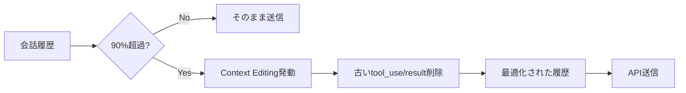
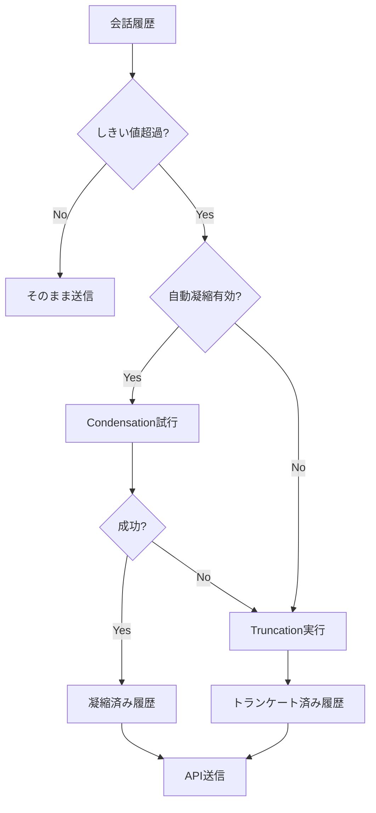
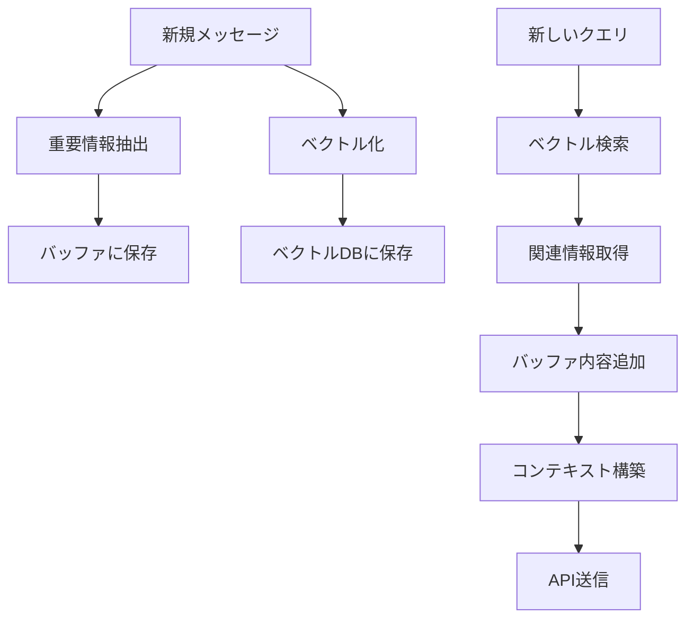
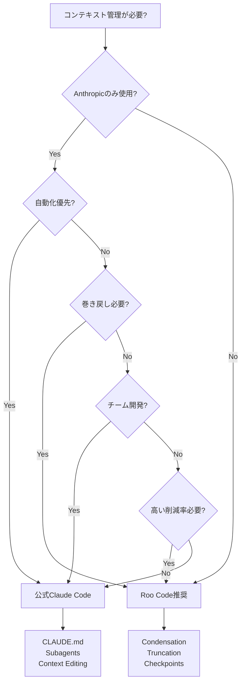
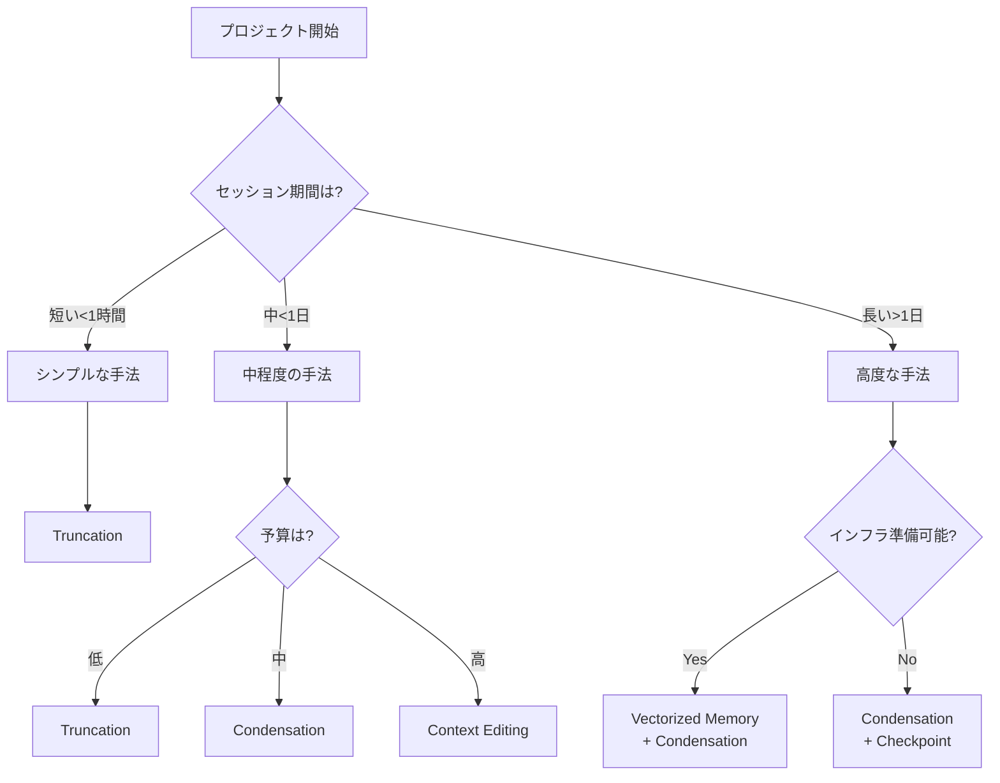

# コンテキスト管理アプローチの比較分析

## 目次
1. [比較の軸](#比較の軸)
2. [公式Claude Code vs Roo Code](#公式claude-code-vs-roo-code)
3. [技術的アプローチの比較](#技術的アプローチの比較)
4. [ユースケース別推奨](#ユースケース別推奨)
5. [統合可能な技術](#統合可能な技術)
6. [意思決定ツリー](#意思決定ツリー)

---

## 比較の軸

コンテキスト管理システムを評価する際の主要な軸：

### 1. 技術的側面

| 軸 | 説明 | 重要度 |
|---|------|--------|
| トークン削減率 | 削減できるトークンの割合 | ⭐⭐⭐⭐⭐ |
| 情報保持率 | 重要情報がどれだけ保持されるか | ⭐⭐⭐⭐⭐ |
| 実装難易度 | システムの複雑さ | ⭐⭐⭐⭐ |
| パフォーマンス | 処理速度とレイテンシ | ⭐⭐⭐⭐ |
| 信頼性 | エラー耐性と予測可能性 | ⭐⭐⭐⭐⭐ |

### 2. 運用側面

| 軸 | 説明 | 重要度 |
|---|------|--------|
| コスト | LLM API呼び出し等の費用 | ⭐⭐⭐⭐⭐ |
| メンテナンス | 継続的な管理の必要性 | ⭐⭐⭐ |
| スケーラビリティ | ユーザー数増加への対応 | ⭐⭐⭐⭐ |
| 可観測性 | モニタリングのしやすさ | ⭐⭐⭐ |

### 3. ユーザー体験

| 軸 | 説明 | 重要度 |
|---|------|--------|
| 透明性 | ユーザーが理解しやすいか | ⭐⭐⭐⭐ |
| 制御性 | ユーザーがコントロールできるか | ⭐⭐⭐ |
| 一貫性 | 予測可能な動作 | ⭐⭐⭐⭐⭐ |

---

## 公式Claude Code vs Roo Code

### 高レベル比較

| 特徴 | 公式Claude Code | Roo Code |
|------|----------------|----------|
| **アプローチ** | 自動化重視 | 柔軟性重視 |
| **主要技術** | Context Editing + Memory Tool | Condensation + Truncation |
| **制御レベル** | 自動（設定最小） | 手動設定可能 |
| **プロバイダー** | Anthropic専用 | マルチプロバイダー |
| **UI統合** | CLI/IDE拡張 | カスタムWebview |
| **オープン性** | プロプライエタリ | オープンソース |

### 詳細比較表

#### 機能比較

| 機能 | 公式Claude Code | Roo Code | 備考 |
|------|----------------|----------|------|
| **自動要約** | ✅ Context Editing | ✅ Condensation | 両方ともLLM使用 |
| **手動制御** | ⚠️ 限定的 | ✅ 完全 | Roo Codeはしきい値等カスタマイズ可能 |
| **メモリ階層** | ✅ 4層（グローバル→ローカル） | ❌ なし | Claude Codeは CLAUDE.md 等 |
| **Subagents** | ✅ タスク分離 | ❌ なし | Claude Code独自 |
| **非破壊的管理** | ⚠️ 部分的 | ✅ 完全 | Roo Codeは巻き戻し可能 |
| **チェックポイント** | ❌ なし | ✅ Shadow Git | Roo Code独自 |
| **プロファイル設定** | ❌ なし | ✅ モデル別しきい値 | |
| **カスタムプロンプト** | ⚠️ CLAUDE.md経由 | ✅ 直接指定可能 | |
| **マルチプロバイダー** | ❌ Anthropicのみ | ✅ OpenAI, Anthropic等 | |

#### 性能比較

| 指標 | 公式Claude Code | Roo Code |
|------|----------------|----------|
| **トークン削減率** | 29-39%（Context Editing） | 30-90%（手法による） |
| **情報保持率** | 高（自動最適化） | 中-高（設定による） |
| **処理速度** | 速い（自動） | 中（要約時は遅い） |
| **API呼び出し** | 1回（要約用） | 1回（要約用） + 本リクエスト |
| **コスト** | 中（要約コスト） | 中-高（カスタマイズ可能） |

---

## 技術的アプローチの比較

### アプローチ1: Context Editing（公式Claude Code）



**特徴**:
- ✅ 自動的に実行
- ✅ 追加設定不要
- ✅ 会話フローを保持
- ⚠️ Anthropicモデルのみ
- ⚠️ 29-39%の削減率（限定的）

**コード例**:
```typescript
// 自動的に適用される
const response = await anthropic.messages.create({
  model: "claude-sonnet-4-20250514",
  max_tokens: 4096,
  messages: conversationHistory
  // Context Editingが自動実行
})
```

### アプローチ2: Condensation + Truncation（Roo Code）



**特徴**:
- ✅ 70-90%の高い削減率
- ✅ フォールバック機構（信頼性）
- ✅ 非破壊的（巻き戻し可能）
- ✅ マルチプロバイダー対応
- ⚠️ 設定が必要
- ⚠️ 要約時のレイテンシ

**コード例**:
```typescript
const result = await manageContext({
  messages,
  totalTokens,
  contextWindow: 200000,
  autoCondenseContext: true,
  autoCondenseContextPercent: 75,
  // ... 詳細設定
})

const effectiveHistory = getEffectiveApiHistory(result.messages)
const response = await api.createMessage(systemPrompt, effectiveHistory)
```

### アプローチ3: Memory Buffering + Vectorized Memory



**特徴**:
- ✅ 80-90%の高い削減率
- ✅ セマンティック検索で精度高い
- ✅ スケーラブル
- ⚠️ インフラ必要（ベクトルDB）
- ⚠️ 実装が複雑
- ⚠️ 埋め込みコスト

---

## ユースケース別推奨

### シナリオ1: シンプルなCLIツール

**要件**:
- 短時間のセッション（<1時間）
- 少数の機能
- メンテナンスコスト最小化

**推奨**: **公式Claude Code**

**理由**:
- 自動化されている
- 設定不要
- Anthropicモデルに最適化

**代替**: Roo Code（Truncationのみ）
```typescript
{
  autoCondenseContext: false  // 要約無効
  // Truncationのみ使用（シンプル）
}
```

---

### シナリオ2: 長期プロジェクト支援

**要件**:
- 長時間セッション（数日〜数週間）
- 複雑なコンテキスト
- 高い情報保持率

**推奨**: **Roo Code（Condensation + Checkpoint）**

**理由**:
- 非破壊的管理（巻き戻し可能）
- チェックポイント統合
- カスタマイズ可能

**設定例**:
```typescript
{
  autoCondenseContext: true,
  autoCondenseContextPercent: 80,  // 高めに設定
  enableCheckpoints: true,
  profileThresholds: {
    "claude-opus-4": 85,  // 高性能モデルは最大限活用
  }
}
```

---

### シナリオ3: マルチプロバイダー環境

**要件**:
- OpenAI + Anthropic + その他
- プロバイダー間の一貫性
- 柔軟な設定

**推奨**: **Roo Code**

**理由**:
- マルチプロバイダー対応
- 統一されたインターフェース
- プロファイル別設定

**設定例**:
```typescript
profileThresholds: {
  "claude-opus-4": 80,
  "gpt-4-turbo": 70,  // 小さいウィンドウ
  "claude-haiku": 60,
  "gpt-3.5": 50       // 非常に小さいウィンドウ
}
```

---

### シナリオ4: エージェント型タスク実行

**要件**:
- 多数のツール呼び出し
- ツール結果が大きい
- コンテキスト効率化が重要

**推奨**: **公式Claude Code（Subagents） + Observation Masking**

**理由**:
- Subagentsでタスク分離
- Context Editingで自動最適化
- ツール結果の自動クリーンアップ

**代替**: Roo Code + Observation Masking（カスタム実装）
```typescript
function maskToolResults(messages: Message[]): Message[] {
  return messages.map(msg => {
    if (isToolResult(msg)) {
      return { ...msg, content: "<MASKED>" }
    }
    return msg
  })
}
```

---

### シナリオ5: チーム開発環境

**要件**:
- 複数開発者
- 統一されたコンテキスト管理
- ドキュメント化された設定

**推奨**: **公式Claude Code（CLAUDE.md）**

**理由**:
- CLAUDE.mdで設定を共有
- メモリ階層（グローバル/プロジェクト/ローカル）
- Subagentsをバージョン管理

**ディレクトリ構造**:
```
project/
├── CLAUDE.md              # チーム共有
├── .claude/
│   ├── agents/            # チーム共有Subagents
│   │   ├── reviewer.md
│   │   └── tester.md
│   └── rules/             # 条件付きルール
│       └── api-rules.md
└── CLAUDE.local.md        # 個人設定（.gitignore）
```

---

## 統合可能な技術

### 公式Claude Code + Roo Code技術の組み合わせ

#### パターン1: ハイブリッド要約

```typescript
class HybridContextManager {
  async manage(messages: Message[]): Promise<Message[]> {
    // ステップ1: Roo CodeのCondensationで大幅削減
    const condensed = await rooCodeCondensation(messages, {
      autoCondenseContextPercent: 70
    })

    // ステップ2: Claude CodeのContext Editingでさらに最適化
    const response = await anthropic.messages.create({
      model: "claude-sonnet-4",
      messages: condensed
      // Context Editing が自動適用
    })

    return response
  }
}
```

**メリット**:
- Roo Codeの高い削減率
- Claude Codeの自動最適化
- 最大限のトークン効率

**デメリット**:
- 複雑性が増す
- 両方のシステムに依存

#### パターン2: CLAUDE.md + プロファイル設定

```markdown
# CLAUDE.md（公式Claude Code用）
## プロジェクト設定
技術スタック: TypeScript, React, Node.js
@docs/architecture.md

## Roo Code設定参照
詳細な凝縮設定: @.roo-code/context-config.json
```

```json
// .roo-code/context-config.json（Roo Code用）
{
  "autoCondenseContext": true,
  "autoCondenseContextPercent": 75,
  "profileThresholds": {
    "claude-opus-4": 80,
    "claude-haiku": 60
  }
}
```

#### パターン3: Subagents + Condensation

```bash
# メインセッション: Claude Code
> "機能Aを実装"

# Subagent呼び出し
> @code-reviewer

# Roo Code凝縮をSubagent内で実行
# （各Subagentが独立したコンテキストを持つ）
```

---

## 意思決定ツリー

### コンテキスト管理手法の選択



### 技術選択フローチャート



---

## まとめ表

### 推奨シナリオ

| シナリオ | 推奨アプローチ | 主要技術 | 理由 |
|---------|-------------|---------|------|
| シンプルCLI | 公式Claude Code | Context Editing | 自動化、設定不要 |
| 長期プロジェクト | Roo Code | Condensation + Checkpoint | 巻き戻し可能、高削減率 |
| マルチプロバイダー | Roo Code | Condensation + Truncation | プロバイダー非依存 |
| エージェント型 | 公式Claude Code | Subagents + Context Editing | タスク分離、自動最適化 |
| チーム開発 | 公式Claude Code | CLAUDE.md + Subagents | 設定共有、標準化 |
| 大規模システム | カスタム | Vectorized Memory + Buffering | スケーラビリティ |

### トレードオフマトリクス

|  | 自動化 | 柔軟性 | 削減率 | 情報保持 | コスト | 実装難易度 |
|---|--------|--------|--------|---------|--------|-----------|
| **公式Claude Code** | ⭐⭐⭐⭐⭐ | ⭐⭐ | ⭐⭐⭐ | ⭐⭐⭐⭐ | ⭐⭐⭐ | ⭐⭐⭐⭐⭐ |
| **Roo Code** | ⭐⭐⭐ | ⭐⭐⭐⭐⭐ | ⭐⭐⭐⭐⭐ | ⭐⭐⭐⭐ | ⭐⭐⭐ | ⭐⭐⭐ |
| **Vectorized Memory** | ⭐⭐⭐ | ⭐⭐⭐⭐ | ⭐⭐⭐⭐⭐ | ⭐⭐⭐⭐⭐ | ⭐⭐ | ⭐⭐ |
| **Memory Buffering** | ⭐⭐⭐⭐ | ⭐⭐⭐ | ⭐⭐⭐⭐⭐ | ⭐⭐⭐⭐⭐ | ⭐⭐⭐⭐ | ⭐⭐⭐ |

---

## 次のステップ

- [05-practical-guide.md](./05-practical-guide.md) - 各アプローチの実践的な実装ガイド

---

## Sources

本ドキュメントは、以下のドキュメントを統合して作成されました：
- [01-official-claude-code.md](./01-official-claude-code.md)
- [02-roo-code-implementation.md](./02-roo-code-implementation.md)
- [03-industry-patterns.md](./03-industry-patterns.md)
- [Roo Code詳細ドキュメント](../context-management/)
